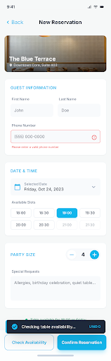

# QuickSeat Reservation (Staff Portal)

A premium Flutter application designed for restaurant staff to manage seat reservations, table layouts, and time slots efficiently.



## 🚀 Key Features

- **Staff Authentication**: Secure login for authorized restaurant personnel.
- **Real-time Bookings**: View and manage customer reservations.
- **Table Management**: Visual layout management for restaurant tables.
- **Slot Management**: Create and manage dining time slots.
- **Professional UI**: Modern, glassmorphism-inspired design with smooth micro-animations.

## 🛠 Technology Stack

- **Framework**: [Flutter](https://flutter.dev) (Dart)
- **Navigation**: [GoRouter](https://pub.dev/packages/go_router) for declarative routing.
- **State Management**: [Provider](https://pub.dev/packages/provider) for reactive UI updates.
- **Backend**: [Firebase](https://firebase.google.com/) (Auth, Firestore).
- **Architecture**: **Clean Architecture** (Data, Domain, Presentation layers).
- **Design System**: Custom design system with consistent tokens for colors, spacing, and typography.

## 📂 Project Structure

```text
lib/
├── app/                # Core application config (themes, routes, constants)
│   ├── config/         # App configuration
│   ├── constants/      # App keys, image paths, strings
│   ├── routes/         # GoRouter definitions
│   ├── theme/          # Custom theme tokens (AppColors, AppSizes)
│   └── widget/         # Reusable common widgets
├── core/               # Shared logic across features (models, prefs)
└── features/           # Feature-based logic
    ├── auth/           # Login flow and session management
    ├── bookings/       # Reservation lists and management
    ├── layouts/        # Management of tables and slots
    ├── mainHome/       # Main dashboard with bottom navigation
    └── splash/         # App initialization flow
```

## 🔄 Working Flows

### 1. App Initialization (Splash Flow)
The app starts with a **Splash Screen** that handles local state checks:
- Delays for 3 seconds to show branding.
- Checks `PrefsHelper` for `isLoggedIn` flag.
- Checks `FirebaseAuth` for an active session.
- **Redirection**:
    - If logged in -> Navigates to `MainHome`.
    - If not logged in -> Navigates to `Login`.

### 2. Authentication Flow
- **Input**: Staff enters business email and password.
- **Validation**: `AuthViewModel` validates inputs and calls `LoginUseCase`.
- **Persistence**: Upon successful Firebase login, user details (UID, Email, Role) are persisted using `PrefsHelper`.
- **Navigation**: Redirects to the dashboard on success.

### 3. Management Dashboard
The `MainHomeView` acts as the primary hub with a dual-tab layout:
- **Bookings Tab**: Monitor upcoming and current reservations.
- **Layouts Tab**: 
    - **Manage Tables**: Add or update physical table icons and status.
    - **Manage Slots**: Configure dining intervals available for booking.

## 🛠 Getting Started

1.  **Clone the Repository**:
    ```bash
    git clone https://github.com/your-repo/quickseatreservation.git
    ```
2.  **Install Dependencies**:
    ```bash
    flutter pub get
    ```
3.  **Run the App**:
    ```bash
    flutter run
    ```

---

*Developed with ❤️ for seamless restaurant operations.*
